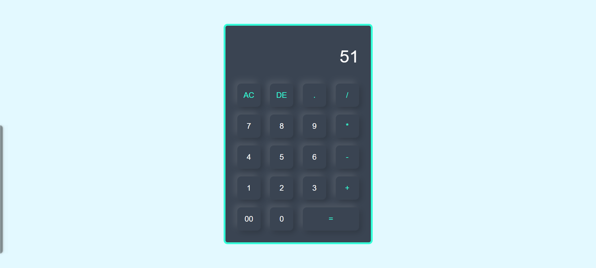

**🧮 Calculator Web App**  
A modern and responsive Calculator Web Application built using HTML and CSS with inline JavaScript. It performs basic arithmetic operations with a clean user interface, smooth button interactions, and real-time display updates.    
🚀 Features  
✅ Perform basic arithmetic operations (+, −, ×, ÷)  
✅ Real-time calculation display  
✅ Delete (DE) and All Clear (AC) functionality  
✅ Responsive design (works on mobile & desktop)  
✅ Smooth button hover and click effects  
✅ Clean and modern UI    
🛠️ Technologies Used  
👉🏻 HTML5 – Structure & Logic (inline JavaScript)  
👉🏻 CSS3 – Styling & Layout    
📂 Project Structure  
calculator-web-app/  
│── index.html  
│── style.css    
⚙️ How It Works  
1️⃣ User clicks number and operator buttons  
2️⃣ The input is displayed in real-time  
3️⃣ On pressing "=" the expression is evaluated  
4️⃣ Result is displayed instantly    
📸 Preview  

    
🧪 Functionality  

- 1. AC button clears the entire display
- 2. DE button removes the last character
- 3. Supports continuous operations

   
🌐 Live Demo 👉🏻 [GitHub](https://your-username.github.io/calculator-web-app/)  
   
   
🤝 Contributing  
   
Contributions are welcome!  
   
Feel free to fork this repository and submit a pull request.  
